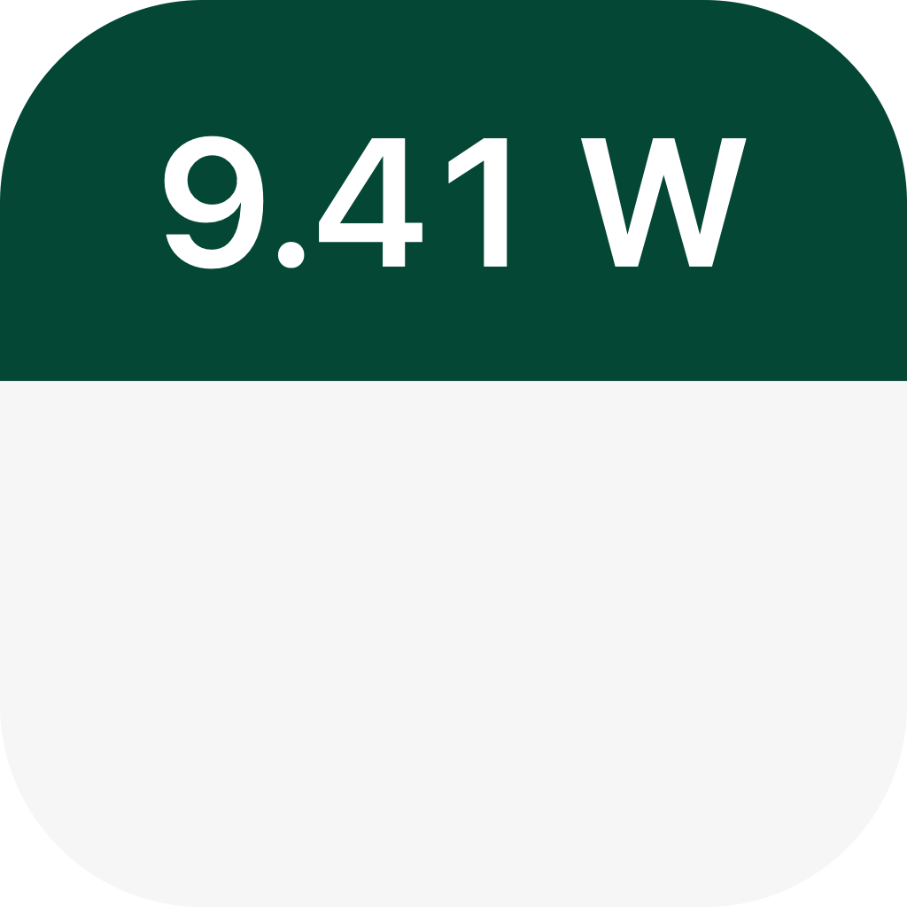
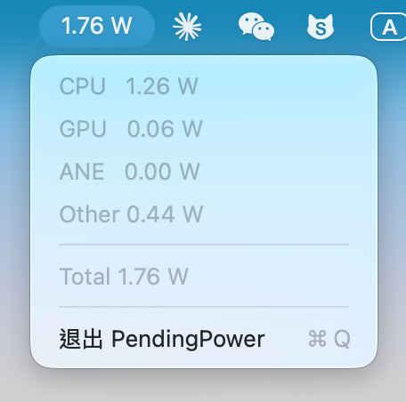

<p align="center">
  
</p>
<h1 align="center">PendingPower</h1>
<p align="center">
  macOS menu bar app showing real-time system power
  <br />
  Mac 菜单栏显示实时功率的工具
</p>


<p align="center">
  <a href="LICENSE"></a>
  
  
  <a href="https://github.com/syncmeta/PendingPower/releases"></a>
</p>


<p align="center">
  
</p>


### 下载 / Download

[Releases](https://github.com/syncmeta/PendingPower/releases) 

M 芯片 Mac，并且系统版本在 macOS 13 或以上 就能用

Requires an Apple Silicon Mac running macOS 13 or later.


## 原理 / How

通过 Apple 私有的 `IOReport` 框架读取 SoC 能量计数器

Reads SoC energy counters through Apple’s private `IOReport` framework.


### 仓库结构

```
Sources/PendingPower/
├── IOReportBridge.swift      私有 IOReport.framework，运行时用 dlsym 解符号
├── PowerMonitor.swift        采样能量计数器，换算成瓦
├── StatusBarController.swift 菜单栏项和它的菜单
└── main.swift                NSApplicationDelegate，把上面两块接起来
Resources/                    Info.plist、entitlements、AppIcon.icns
scripts/                      build.sh · build-dmg.sh · make-icon.swift · smoke.swift
```


### Repository layout

```
Sources/PendingPower/
├── IOReportBridge.swift      private IOReport.framework, resolved via dlsym at runtime
├── PowerMonitor.swift        samples the energy counters, turns them into watts
├── StatusBarController.swift the menu bar item and its menu
└── main.swift                NSApplicationDelegate, wires the two together
Resources/                    Info.plist, entitlements, AppIcon.icns
scripts/                      build.sh · build-dmg.sh · make-icon.swift · smoke.swift
```


### 许可 / License

MIT
